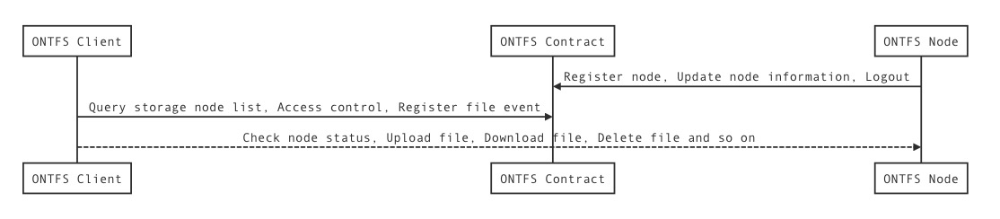
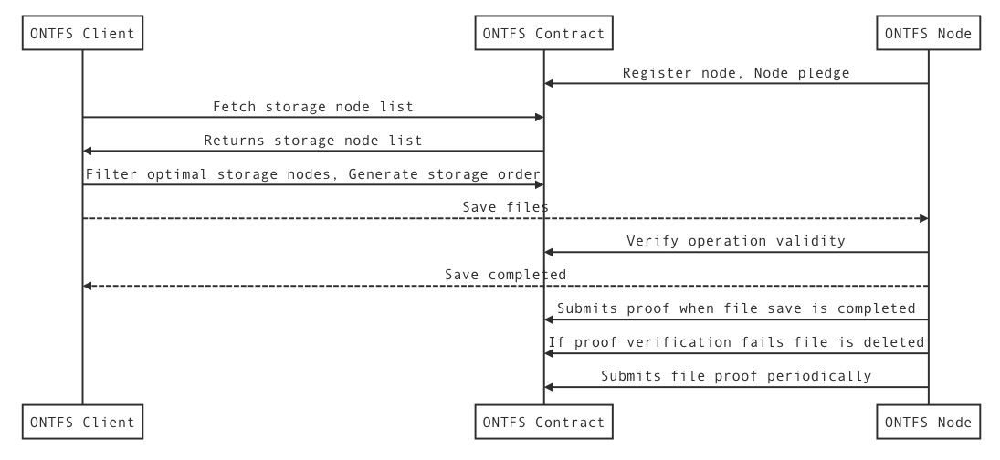
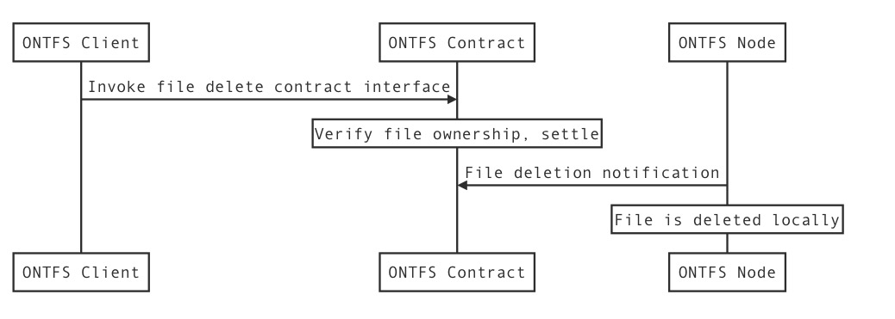

[EN](ontfs_arc_EN.md) | 中文

一、OntFs部署
===

### 1.部署示意图

### 2.角色：

* ontfs:

运行了ontfs存储服务且具有公网Ip的专用节点，并配备了相应的CLI命令行工具、配置文件和数据库。

* ont-fs-client:

以ont-fs-sdk为核心调用的一个应用，可以用来执行文件上传，下载，删除等操作

* ontology:

部署了ontfs合约且对外开放了rpc服务的ontology节点

二、OntFs系统模块交互原理
===

三、OntFs文件操作交互流程
===
### 1.上传文件交互:

---
### 2.下载文件交互:

---
### 3.删除文件交互:

