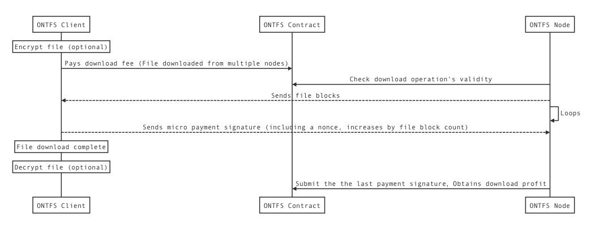

EN | [中文](ontfs_arc.md)

# 1. ONTFS Deployment
===

### 1. Deployment Schematic Diagram

### 2. Parties Involved:

* ONTFS:

Service node that runs the ONTFS **storage service** and has a public network IP, provides the corresponding **command line tools**, **configuration files**, and **database**.

* ONTFS Client:

An application that is run on the ONTFS `SDK`. It can be used to carry out **file upload**, **download** and **deletion**.

* Ontology:

Ontology nodes that deploy the ONTFS **smart contract** and make the `RPC` service publicly available.

# 2. ONTFS System Internal Module Interaction
===

# 3. ONTFS File Operations Interaction
===
### 1. File upload process:

---
### 2. File download process:

---
### 3. Fiel deletion process:

