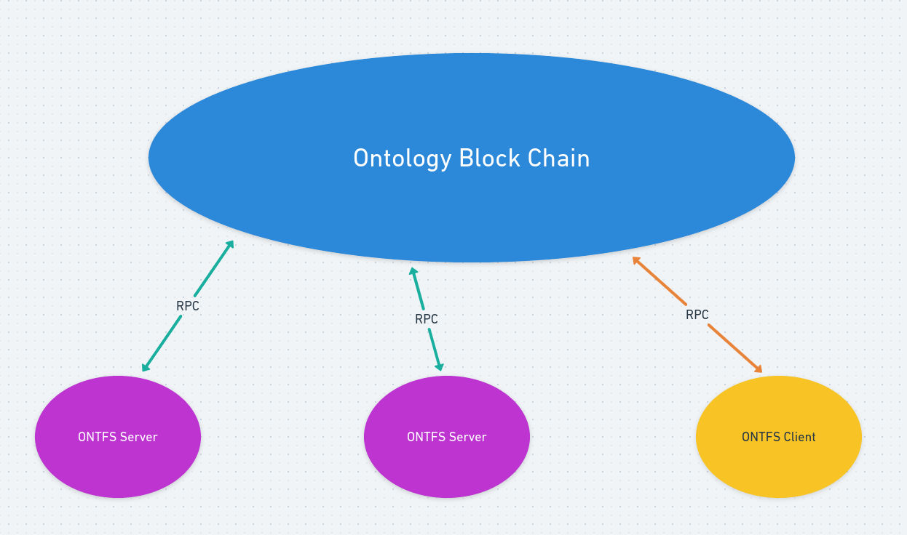
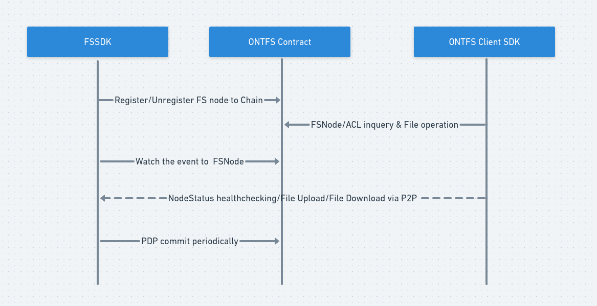
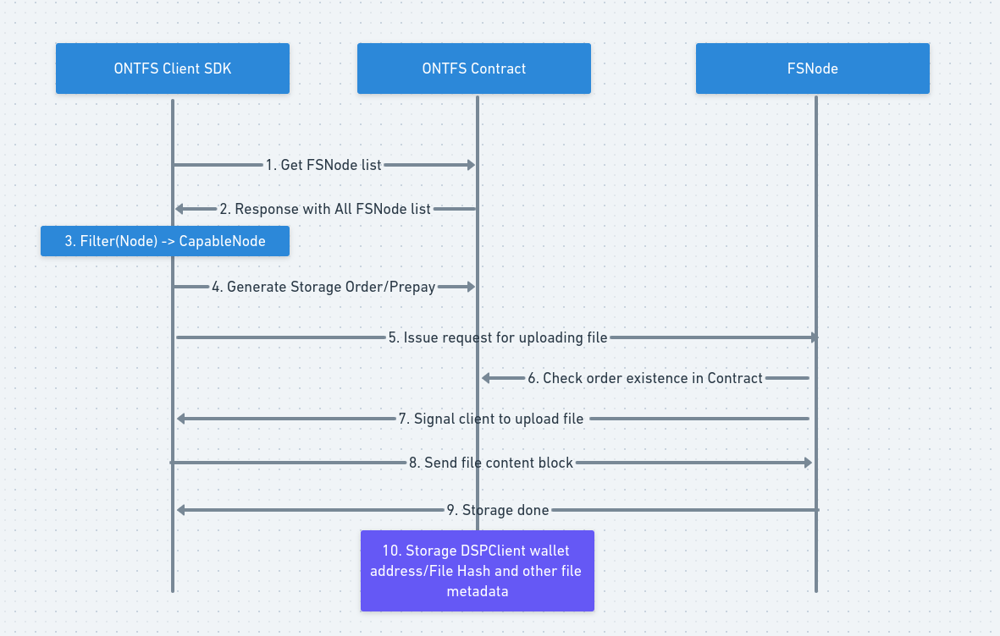
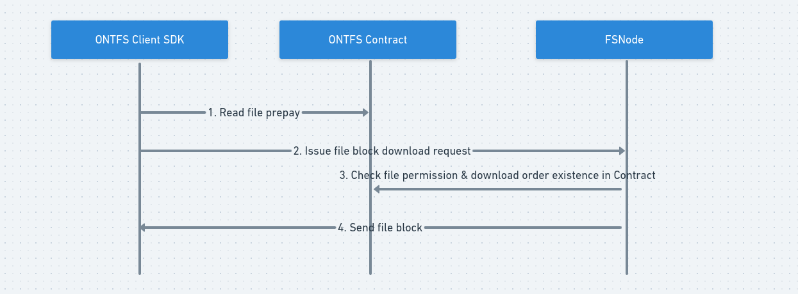
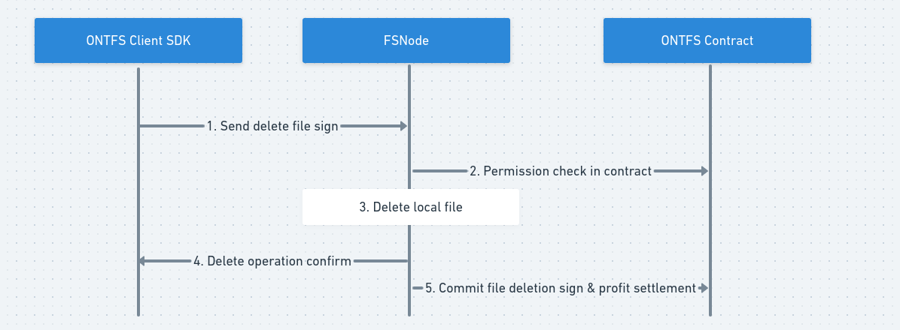

# ontfs 组网结构
## 部署方式
### 角色
#### ONTNode:

运⾏了Ontology并对外开放Rpc服务的节点，且已经完成了OntFs合约部署，即ontfs版本的ontology。
#### FSNode:

运⾏了存储服务的节点，可以是Ontology节点，也可以是具有公⽹Ip的专⽤节点，存储服务为以FSSDK为核⼼调⽤启动的⼀个独⽴进程，并有相应的配置⽂件和数据库。
#### DSPClient:

以DspSdk为核⼼调⽤的⼀个应⽤，可以⽤来执⾏⽂件上传，下载，删除等操作。

## 部署方式如下：

需要保证 ONTFSServer与Chain，以及Client与Chain之间的四层联通。

## ONTFS系统内部模块组成：

1. FSSDK

    主要为FsNode的存储服务提供,节点链上注册、更新、查询、注销、存储服务启动停止、利润结算等功能

2. DSPSDK

    主要为DspClient提供文件上传、删除、下载、查询、FsNode列表查询等功能

3. ONTFS合约

    部署在Ontology上实现了FsNode及待操作的文件相关信息链上管理,与FSSDK和DSPSdk都有交互

## 模块具体接口功能：
### FSSDK

提供cli+功能接口：

1. 注册节点

    FsNode可调用该接口向合约注册节点信息,表示本节点可以对外提供存储服务,注册信息包括:本节点钱包地址,存储服务网络地址,可提供的最大存储空间等。

2. 查询已上链的本节点信息

    FsNode可调用该接口向合约查询节点信息

3. 更新节点信息

    FsNode可调用该接口向合约更新节点信息

4. 注销节点

    FsNode可调用该接口向合约注销节点信息,同时完成了利润结算。

5. 查询利润、惩罚数额

    FsNode可调用该接口向合约查询已完成存储任务的结算利润、未完成暂时还不能提取的利润、可能的因未能按期提交PDP证明而引起的惩罚数额等

6. 提取利润

    FsNode可调用该接口向合约提取已经完成存储任务的结算利润到本地钱包

7. 启动存储服务
   FsNode可调用该接口完成本地存储服务初始化,启动P2P提供存储服务

8. 停止存储服务

   FsNode可调用该接口完成关闭本地存储功能,关闭P2P终止存储服务

9. 查询本地存储详情

    FsNode可调用该接口从本地数据库中查询已经所有存储文件个数、所有已存储文件占用空间大小、每个文件起始时间、到期时间、大小、提交Prove的次数

10. 配置文件中策略配置

### DSPSDK

提供cli + 功能接口：

1. 从链上获取所有FsNode信息列表

    DspClient调用DspSdk从合约查询所有的FsNode的信息列表

2. 检测FsNode服务状态,是否可以正常上传下载,延迟

    DspClient调用DspSdk通过网络直接向FsNode发起服务状态请求。存储服务节点状态正常的情况下返回服务节点状态。接口用来在获取到所有FsNode信息列表后,检测可用的FsNode服务状态,筛选出可用的待选服务器列表,为后续文件操作做准备

3. 上传文件(提供是否加密选项)

   

4. 文件续费
   DspClient调用DspSdk接口在合约上为文件续费,更新文件周期内需要提交的总PDP次数,FsNode则会定期查询是否需要提交PDP,PDP次数提交满之后文件周期终止
5. 查询单个上传文件的信息

   DspClient调用DspSdk接口从合约查询文件信息,如:文件到期时间,存储有该文件的服务器列表等
6. 查询单用户所有文件列表

    DspClient调用DspSdk接口从合约获取该用户存储的所有文件的列表
7. 下载文件

   

8. 删除文件

   

9. 断点续传

   文件上传下载支持断点续传

10. 上传下载进度返回

    上传下载接口返回任务进行进度

11. 块高和时间的比例换算接口用于时间点对应Ontology具体块高的转换

12. 权限,白名单

    文件允许设置下载权限
